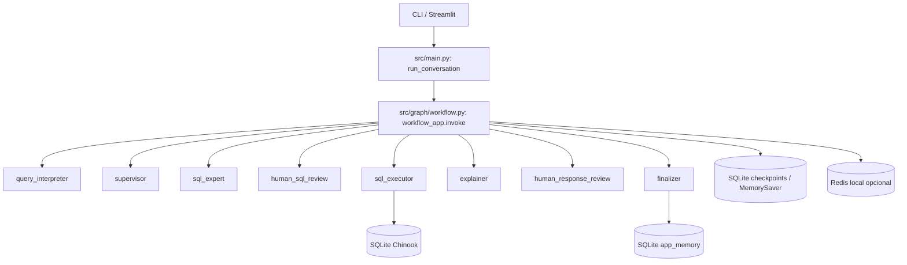
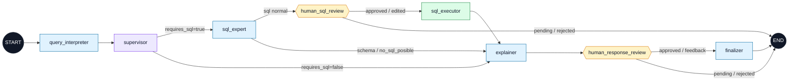

## LangGraphPoC – Asistente Chinook (CLI + Streamlit)

PoC multiagente que responde preguntas sobre la base de datos **Chinook** (SQLite) usando LangGraph + LangChain, con *Human-in-the-loop* (HITL) para aprobar SQL y respuestas finales.

### Levantar infraestructura

```bash
cd infraestructure
docker compose up -d
```

### Ejecución

Preparar un entorno conda y ejecutar con:

CLI interactivo:

```bash
conda run -n agente --no-capture-output python -m src.main
```

Streamlit (HITL visual):

```bash
streamlit run app.py
```

### Variables de entorno
Se debe tener el archivo .env en el directorio raiz, con lo siguiente:

Requeridas:

- `OPENAI_API_KEY`

Recomendadas:

- `SQLITE_DB_PATH=./data/Chinook.sqlite` (archivo existe en `data/Chinook.sqlite`)

Opcionales:

- `REDIS_URL`
- `SUPABASE_DB_URL` (checkpointing si usas `src/graph/workflow.py`)
- `LANGSMITH_API_KEY`, `LANGSMITH_PROJECT`

---

### Bases de datos

| Uso | Tecnología | Archivo/servicio |
|---|---|---|
| Datos de negocio Chinook | SQLite | `data/Chinook.sqlite` |
| Memoria persistente | SQLite | `data/app_memory.sqlite` |
| Checkpoints LangGraph | SQLite local si está disponible, fallback en memoria | `data/langgraph_checkpoints.sqlite` |
| Eventos efímeros | Redis local opcional | `localhost:6379` |

---
### Diagrama de arquitectura



### Diagrama del flujo LangGraph de la PoC




---

### Clases principales (resumen corto)

- `src/graph/workflow.py`: define el `StateGraph`, nodos, rutas condicionales, HITL y checkpointer local.
- `src/main.py`: fachada CLI/Streamlit que invoca el grafo compilado.
- `QueryInterpreterAgent`: clasifica intención y decide si requiere SQL.
- `SupervisorAgent`: enruta y finaliza respuesta.
- `SQLExpertAgent`: genera, valida y ejecuta SQL seguro `SELECT` sobre Chinook.
- `ExplainerAgent`: convierte resultados técnicos en respuesta en español.
- `SQLiteManager`: consulta la base Chinook.
- `LocalMemoryManager`: persiste conversaciones y memorias en SQLite local.
- `LongTermMemory`: API de memoria persistente sobre `LocalMemoryManager`.
- `RedisManager`: publica eventos opcionales del flujo.
- `AgentState`: contrato de estado compartido por LangGraph.

---

### Agentes y responsabilidades

- **Query Interpreter**: interpreta la pregunta, extrae intención y decide si requiere SQL.
- **Supervisor**: decide el siguiente agente y finaliza la respuesta con feedback humano.
- **SQL Expert**: construye SQL seguro, solicita aprobación humana y ejecuta en SQLite.
- **Explainer**: redacta la explicación en lenguaje natural a partir de resultados.

---

### Tecnologías usadas

- Python
- LangGraph (orquestación de agentes)
- LangChain + OpenAI (LLMs)
- SQLite (Chinook)
- Streamlit (UI HITL)
- Pandas (tablas en UI)
- Redis (event streaming)
- Supabase (memoria persistente)
