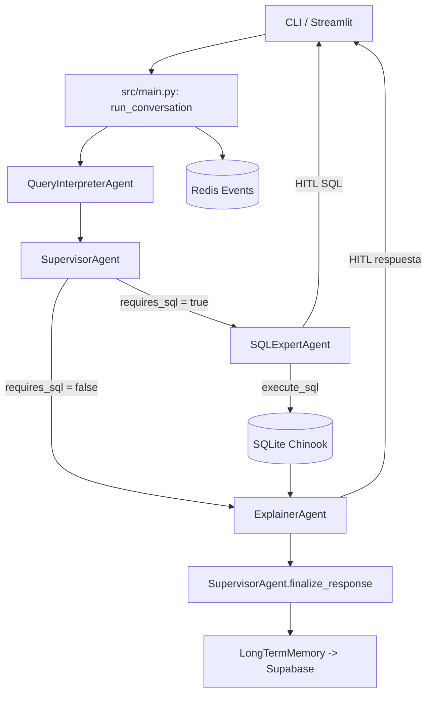

## LangGraphPoC – Asistente Chinook (CLI + Streamlit)

PoC multiagente que responde preguntas sobre la base de datos **Chinook** (SQLite) usando LangGraph + LangChain, con *Human-in-the-loop* (HITL) para aprobar SQL y respuestas finales.

### Ejecución

Preparar un entorno conda y ejecutar con:

CLI interactivo:

```bash
conda run -n agente --no-capture-output python -m src.main
```

Streamlit (HITL visual):

```bash
streamlit run app.py
```

### Variables de entorno

Requeridas:

- `OPENAI_API_KEY`
- `SUPABASE_URL`
- `SUPABASE_SERVICE_ROLE_KEY`

Recomendadas:

- `SQLITE_DB_PATH=./data/Chinook.sqlite` (archivo existe en `data/Chinook.sqlite`)

Opcionales:

- `REDIS_URL`
- `SUPABASE_DB_URL` (checkpointing si usas `src/graph/workflow.py`)
- `LANGSMITH_API_KEY`, `LANGSMITH_PROJECT`

---

### Diagrama de arquitectura (Markdown)



---

### Clases principales (resumen corto)

- `QueryInterpreterAgent` (`src/agents/query_interpreter.py`): clasifica intención y decide si se requiere SQL. Usa LLM con prompt estructurado.
- `SQLExpertAgent` (`src/agents/sql_expert.py`): genera, valida y ejecuta SQL seguro contra Chinook. Incluye flujo de aprobación humana.
- `ExplainerAgent` (`src/agents/explainer.py`): convierte resultados en explicación clara en español. Maneja casos especiales como listado de tablas.
- `SupervisorAgent` (`src/agents/supervisor.py`): enruta el flujo entre agentes y consolida la respuesta final.
- `SQLiteManager` (`src/db/sqlite_manager.py`): ejecuta consultas y expone el esquema de la base Chinook.
- `RedisManager` (`src/db/redis_manager.py`): publica eventos del flujo y estado en Redis.
- `SupabaseManager` (`src/db/supabase_manager.py`): persiste conversaciones y memorias en Supabase.
- `LongTermMemory` (`src/memory/long_term.py`): API de memoria persistente sobre Supabase.
- `ShortTermMemory` (`src/memory/short_term.py`): utilidades para resumir y formatear contexto reciente.
- `Settings` (`src/config/settings.py`): carga configuración desde `.env` y define defaults del runtime.
- `AgentState` (`src/graph/state.py`): contrato del estado del grafo para LangGraph.

---

### Agentes y responsabilidades

- **Query Interpreter**: interpreta la pregunta, extrae intención y decide si requiere SQL.
- **Supervisor**: decide el siguiente agente y finaliza la respuesta con feedback humano.
- **SQL Expert**: construye SQL seguro, solicita aprobación humana y ejecuta en SQLite.
- **Explainer**: redacta la explicación en lenguaje natural a partir de resultados.

---

### Tecnologías usadas

- Python
- LangGraph (orquestación de agentes)
- LangChain + OpenAI (LLMs)
- SQLite (Chinook)
- Streamlit (UI HITL)
- Pandas (tablas en UI)
- Redis (event streaming)
- Supabase (memoria persistente)
